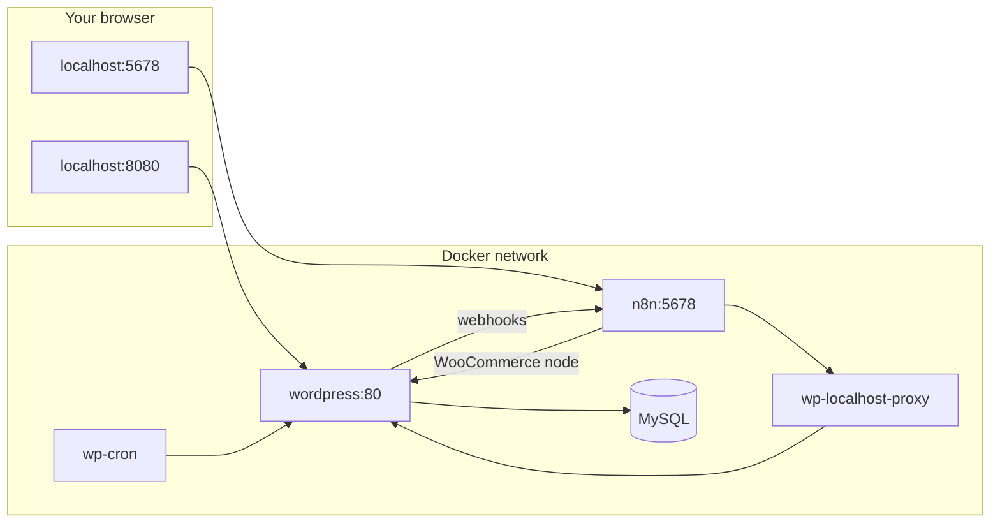

# WooCommerce + n8n Local Lab

A local Docker environment for running **WordPress**, **WooCommerce**, and **n8n** together. The stack is tuned so the **n8n WooCommerce node** and **webhooks** work reliably without HTTPS/SSL setup or manual URL hacks.

---

## What you get

| Component | Purpose |
|---|---|
| **WordPress + WooCommerce** | Store and REST API (`/wp-json/wc/v3/...`) |
| **n8n** | Automations, WooCommerce node, webhook triggers |
| **MySQL** | WordPress database |
| **WP-Cron sidecar** | Delivers queued webhooks on a schedule |
| **localhost proxy** | Lets n8n reach WordPress using the same URL you see in the browser |
| **Mu-plugin** | HTTP-only mode, URL rewriting, REST API fixes for Docker |

---

## Prerequisites

- [Docker Desktop](https://www.docker.com/products/docker-desktop/) installed and running
- Ports **8080** (WordPress) and **5678** (n8n) free on your machine
- PowerShell or any terminal with `docker compose`

---

## Quick start

```powershell
cd woocommerce-n8n-lab
docker compose up -d
```

Wait until all containers are healthy (`docker compose ps`).

| Service | URL | Default login |
|---|---|---|
| WordPress | http://localhost:8080 | Set during WP install (or your existing admin) |
| n8n | http://localhost:5678 | `admin` / `admin123` |

**First time only:** open http://localhost:8080, finish WordPress setup, install **WooCommerce**, and create REST API keys (see below).

---

## Project structure

```
woocommerce-n8n-lab/
├── docker-compose.yml          # Full stack definition
├── php-custom.ini              # PHP memory limits for WordPress
├── mu-plugins/
│   └── local-docker.php        # Docker + WooCommerce REST fixes (required)
└── README.md
```

The mu-plugin is mounted automatically. Do not remove it — `docker-compose.yml` alone is not enough for n8n ↔ WooCommerce to work.

---

## Architecture



### Containers

| Container | Service | Role |
|---|---|---|
| `woocommerce_db` | MySQL 8 | Database |
| `woocommerce_wp` | WordPress | Store, WooCommerce, REST API |
| `woocommerce_wp_cron` | curl | Hits `wp-cron.php` every 60s |
| `n8n` | n8n | Workflows and WooCommerce node |
| `wp_localhost_proxy` | socat | Forwards port 8080 inside n8n → WordPress |

---

## The Docker networking problem (and why n8n “crashed”)

When you run WordPress and n8n in separate containers, **“localhost” does not mean the same thing everywhere**.

| Where the request starts | What `localhost:8080` means |
|---|---|
| Your browser | WordPress on your PC ✅ |
| Inside the **n8n** container | The n8n container itself ❌ (not WordPress) |

So if you put `http://localhost:8080` in the n8n WooCommerce credential, the first call often fails with connection refused. Even when the first call works (e.g. via `http://wordpress:80`), WooCommerce used to return JSON with links like:

```json
"permalink": "http://localhost:8080/product/..."
"_links": { "self": [{ "href": "http://localhost:8080/wp-json/wc/v3/products/38" }] }
```

n8n follows those URLs on later steps → same failure → the node looks like it **crashes** or hangs.

A second common issue is **HTTPS**: this stack has **no SSL certificate**. Using `https://localhost:8080` or `https://wordpress:80` causes TLS errors.

This lab fixes both problems automatically (see [How the fixes work](#how-the-fixes-work)).

---

## Connect n8n to WooCommerce (step by step)

### 1. Create REST API keys in WooCommerce

1. WordPress admin → **WooCommerce** → **Settings** → **Advanced** → **REST API**
2. **Add key**
3. Description: e.g. `n8n`
4. User: your admin user
5. Permissions: **Read/Write**
6. **Generate API key**
7. Copy **Consumer key** (`ck_...`) and **Consumer secret** (`cs_...`) with WooCommerce’s **Copy** button (no trailing spaces)

### 2. Add credentials in n8n

1. Open http://localhost:5678
2. **Credentials** → **Add credential** → **WooCommerce API**
3. Fill in:

| Field | Value | Notes |
|---|---|---|
| **WooCommerce URL** | `http://wordpress:80` | **Recommended** — direct Docker service name |
| **Consumer Key** | `ck_...` | From step 1 |
| **Consumer Secret** | `cs_...` | From step 1 |
| **Include Credentials in Query** | **ON** | Required for HTTP in Docker |

**Alternative URL:** `http://localhost:8080` also works thanks to `wp-localhost-proxy` (same URL as in your browser).

### 3. Test with a real node (not the credential Test button)

1. New workflow → add **WooCommerce** node
2. Select your credential
3. Resource: **Product**, Operation: **Get All**
4. **Execute step**

The credential **Test** button often returns a false failure in Docker even when the node works. Always verify with **Execute step**.

### URLs — use vs avoid

| URL | Works from n8n? |
|---|---|
| `http://wordpress:80` | ✅ Best choice |
| `http://localhost:8080` | ✅ Via proxy |
| `http://host.docker.internal:8080` | ✅ Reaches host-mapped port |
| `https://localhost:8080` | ❌ No SSL in this stack |
| `https://wordpress:80` | ❌ No SSL |
| `localhost:8080` (no `http://`) | ❌ Invalid |
| `wordpress:80` (no `http://`) | ❌ Invalid |

In **HTTP Request** nodes you can use the env var:

```
{{ $env.WOOCOMMERCE_URL }}/wp-json/wc/v3/orders
```

(`WOOCOMMERCE_URL` is set to `http://wordpress:80` in `docker-compose.yml`.)

---

## Webhooks: WooCommerce → n8n

Outgoing webhooks (order created, product updated, etc.) are delivered by WordPress/WooCommerce to a URL you configure in n8n.

### Setup

1. In **n8n**: create a workflow with a **Webhook** trigger
2. **Activate** the workflow (toggle top-right)
3. Copy the **Production** URL, e.g. `http://localhost:5678/webhook/abc-123-def`
4. In WordPress: **WooCommerce** → **Settings** → **Advanced** → **Webhooks** → **Add webhook**
   - **Delivery URL:** paste the n8n URL **as shown** (`http://localhost:5678/...` is fine)
   - **Status:** Active
   - **Topic:** e.g. Order created
5. Save

### Delivery timing

WooCommerce queues webhooks via Action Scheduler, which depends on WP-Cron. In Docker, normal WP-Cron loopback fails, so this stack:

- Sets `DISABLE_WP_CRON` in WordPress
- Runs **`wp-cron`** sidecar that calls `http://wordpress/wp-cron.php` every **60 seconds**

Expect webhook delivery within about **one minute** after the event.

### URL rewriting (automatic)

When WordPress sends a webhook, the mu-plugin rewrites browser URLs to Docker service names:

| You configure | WordPress actually calls |
|---|---|
| `http://localhost:5678/webhook/...` | `http://n8n:5678/webhook/...` |
| `http://localhost:8080/...` | `http://wordpress:80/...` |

You can paste n8n URLs directly from the n8n UI into WooCommerce.

---

## How the fixes work

### 1. `mu-plugins/local-docker.php`

Loaded on every WordPress request. It:

- **Forces HTTP** for site URL, permalinks, and redirects (no accidental HTTPS)
- **Enables WooCommerce REST API** if it was disabled
- **Allows API key auth over HTTP** (WooCommerce normally expects HTTPS for Basic Auth; WP 7+ removed the old workaround filter)
- **Forwards `Authorization` headers** so n8n Basic Auth reaches WooCommerce
- **Rewrites REST JSON URLs** for internal requests: `localhost:8080` → `wordpress:80` so n8n follow-up calls stay inside Docker
- **Rewrites outbound HTTP** from WordPress (webhooks, etc.) from `localhost` to container hostnames
- **Bootstraps permalinks** and Apache rewrite rules so `/wp-json/` is not 404 on fresh installs

### 2. `wp-localhost-proxy`

A tiny **socat** process sharing the n8n container’s network. It listens on **port 8080** (IPv4 and IPv6) and forwards to `wordpress:80`.

That way, if you use `http://localhost:8080` in n8n (the same URL you use in the browser), traffic still reaches WordPress.

### 3. `wp-cron` sidecar

Runs `curl http://wordpress/wp-cron.php?doing_wp_cron` every 60 seconds so scheduled tasks and webhook delivery work without manual intervention.

### 4. n8n environment

| Variable | Value | Purpose |
|---|---|---|
| `N8N_PROTOCOL` | `http` | Webhook URLs use `http://`, not `https://` |
| `N8N_SECURE_COOKIE` | `false` | Editor works over plain HTTP |
| `WEBHOOK_URL` | `http://localhost:5678/` | Production webhook base URL in UI |
| `WOOCOMMERCE_URL` | `http://wordpress:80` | For expressions in workflows |

---

## Useful commands

```powershell
# Start the stack
docker compose up -d

# Check status
docker compose ps

# View logs
docker compose logs -f wordpress
docker compose logs -f n8n
docker compose logs -f wp-cron

# Stop (keep data)
docker compose down

# Stop and delete all data (fresh WordPress + n8n)
docker compose down -v

# Manually trigger WP-Cron (don’t wait 60s for a webhook)
docker exec woocommerce_wp curl -s "http://127.0.0.1/wp-cron.php?doing_wp_cron"

# Test WooCommerce REST API from inside Docker
docker run --rm --network woocommerce-n8n-lab_default curlimages/curl:latest `
  "http://wordpress:80/wp-json/wc/v3/products?per_page=1&consumer_key=YOUR_CK&consumer_secret=YOUR_CS"
```

---

## Troubleshooting

| Symptom | Likely cause | What to do |
|---|---|---|
| n8n WooCommerce node fails / “crashes” | Wrong URL or HTTPS | Use `http://wordpress:80`, turn **Include Credentials in Query** ON |
| Credential Test fails but node might work | Known n8n quirk in Docker | Use **Execute step** on a Product → Get All node |
| `401 Unauthorized` | Bad keys or REST API off | Re-copy keys; ensure mu-plugin is mounted; restart stack |
| `/wp-json/` returns 404 | Plain permalinks | Restart stack — mu-plugin fixes permalinks on boot |
| Webhook never fires | Workflow not active | Toggle workflow **Active** in n8n |
| Webhook delayed ~60s | Normal | WP-Cron runs every minute; or trigger cron manually (command above) |
| Delivery log: connection error | Missing mu-plugin | Ensure `mu-plugins/local-docker.php` exists, `docker compose up -d` |
| HTTPS / SSL errors | Using `https://` locally | Use `http://` only; disable Really Simple SSL if installed |
| Port in use | Another app on 8080/5678 | Change ports in `docker-compose.yml` (e.g. `"8081:80"`) |
| Rank Math / plugin OOM on heavy pages | Plugin memory use | REST API from n8n is fine; mu-plugin skips nothing — increase PHP memory in `php-custom.ini` if needed |

---

## Configuration reference

### WordPress / PHP

- PHP memory: **1024M** (`php-custom.ini` + `WP_MEMORY_LIMIT`)
- Site URL: **http://localhost:8080** (browser)
- Internal URL for containers: **http://wordpress:80**

### Database (local dev only — do not use in production)

| Setting | Value |
|---|---|
| Database | `wordpress` |
| User | `wp_user` |
| Password | `wp_pass` |
| Root password | `root` |

### n8n login (local dev only)

| User | Password |
|---|---|
| `admin` | `admin123` |

Change these if you expose the stack beyond your machine.

---

## Typical workflows

### Read products/orders from WooCommerce in n8n

1. WooCommerce REST API keys → n8n **WooCommerce API** credential (`http://wordpress:80`)
2. WooCommerce node → Product/Order → Get All → Execute step

### Send WooCommerce events to n8n

1. n8n Webhook trigger → activate workflow → copy Production URL
2. WooCommerce webhook → paste URL → choose topic (e.g. order.created)
3. Trigger event in store → check **n8n → Executions** within ~60s

---

## License / notes

This is a **local development lab**. Credentials are weak by design. Do not deploy this compose file to production without hardening (secrets, HTTPS, strong passwords, no default logins).
